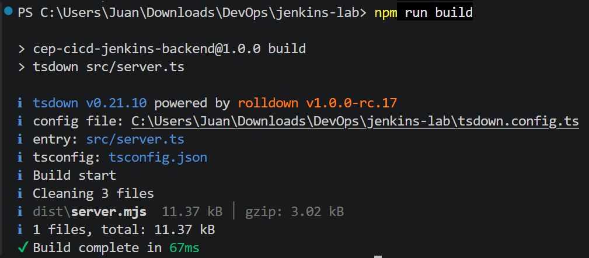
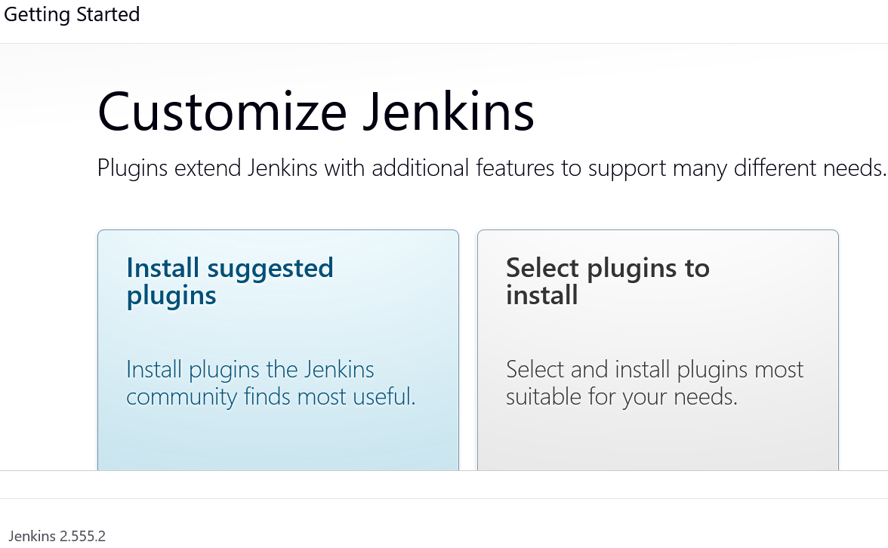

# Laboratorio Jenkins : Automatización CI/CD con Jenkinsfile sobre el proyecto backend

# 📋 Task 1. Creación del repositorio

1.  Como en el nuevo repositorio sólo queremos una parte del original, inicialmente no descargamos el contenido de los archivos (_blobs_), sólo la estructura y el historial mínimo y con `--sparse` indicamos que sólo queremos una parte

        git clone --filter=blob:none --sparse https://github.com/Lemoncode/CEP-Introduccion-Devops

2.  Indicamos que sólo estamos interesados en la carpeta `backend`

    ```bash
    cd CEP-Introduccion-Devops
    git sparse-checkout set 04-jenkins/backend
    ```

3.  Preparamos la carpeta raíz del nuevo repo y copiamos el contenido de `04-jenkins/backend`

    ```bash
    cd ..
    mkdir jenkins-lab
    cp -r CEP-Introduccion-Devops/04-jenkins/backend/* jenkins-lab
    ```

4.  Añadimos el archivo con el enunciado de la práctica, el Diario del Lab (este archivo) y una carpeta para las capturas.

    ```bash
    cp CEP-Introduccion-Devops/04-jenkins/enunciado.md jenkins-lab
    touch jenkins-lab/DiarioJenkinsLab.md
    mkdir jenkins-lab/capturas
    ```

5.  Creamos el nuevo repo

    ```bash
    cd jenkins-lab
    git init
    git add .
    git commit -m "Initial commit"
    ```

6.  Creamos un nuevo repositorio público en Github, sin `README.md` para evitar conflictos

7.  Vinculamos el repo local con el remoto y subimos el contenido

    ```bash
    git remote add origin https://github.com/juanraprofe/cep-devops-jenkins-lab.git
    git branch -M main
    git push -u origin main
    ```

---

# 📋 Task 2. Validación local del proyecto

Antes de empezar a elaborar el `Jenkinsfile` vamos a comprobar que el proyecto funciona correctamente en local. Para ello vamos a ejecutar uno a uno los siguientes comandos:

```bash
npm install
npm run format:check
npm run lint
npm run type-check
npm run test
npm run build
```

Todo estará correcto si no falla ninguno y tras el `build` se genera el archivo `dist/server.mjs`.

Detectamos que varias etapas críticas (type-check, test y build) fallan debido a la ausencia del cliente generado de `Prisma`. Los errores observados indican la imposibilidad de resolver imports hacia `./prisma/client`, que es utilizado por distintos módulos del backend.

Revisamos el archivo `package.json`, y se identifica la existencia del script:

    npm run prisma:generate

Esto indica que el proyecto requiere una fase previa de generación del cliente `Prisma` antes de ejecutar procesos dependientes de tipos, tests o compilación.

Por ello, se decide incorporar esta operación como una etapa (`stage`) adicional dentro del pipeline CI/CD, aunque el enunciado no la menciona explícitamente, ya que parece claro que es una dependencia necesaria para la correcta ejecución del proyecto.

Para comprobar que no falta ninguna otra dependencia y que el proyecto funciona correctamente ejecutamos el script de `Prisma` y a continuación volvemos a ejecutar los comandos que fallaban.

```bash
npm run prisma:generate
npm run type-check
npm run test
npm run build
```

Todas las operaciones se completan sin errores y el `build` genera los archivos previstos

<figure>
    
    <figcaption>Fig. El 'build' se ejecuta correctamente</figcaption>
</figure>

---

# 📋 Task 3. Elaboración del Jenkinsfile

## 🤵 Jenkinsfile base

Antes de implementar las etapas (`stages`), vamos a definir la estructura base del `pipeline`. Así nos aseguramos de que la configuración global del `job` está correctamente definida y es conforme con lo que nos pide el enunciado, antes de añadir lógica de ejecución.

Lo que añadimos ahora son todos aquellos elementos que se definen fuera de `stages{}` porque no forman parte del flujo de ejecución principal, sino del ciclo de vida del `pipeline`.

```groovy
pipeline {
    agent any

    options {
        disableConcurrentBuilds()
        timestamps()
        timeout(time: 5, unit: 'MINUTES')
    }

    environment {
        FORCE_COLOR = '0'
        NO_COLOR = 'true'
    }

    stages {

    }

    post {
        success {
            echo 'Pipeline completed successfully!'
        }
        failure {
            echo 'Pipeline failed. Review logs.'
        }
        always {
            cleanWs()
        }
    }
}
```

### ➡️ options {}

Aquí configuramos las opciones del job que nos pide el punto 1 del enunciado

- Deshabilitar builds concurrentes.
- Mostrar marcas de tiempo.
- Timeout de 5 minutos.

Estas opciones afectan al comportamiento global del `pipeline`, por lo que debemos definirlas antes de cualquier `stage`.

### ➡️ environment {}

Aquí definimos las variables de entorno globales que nos pide el punto 2 del enunciado:

- `FORCE_COLOR`: Tendrá el valor numérico `0`.
- `NO_COLOR`: Tendrá el valor booleano `true`.

Deben estar disponibles en todas las etapas (el enunciado nos dice que las _heredarán todas las etapas_) y no dependen de la ejecución de ningún `stage`. Por tanto, como ocurría con `options{}` deben declararse a nivel superior.

### ➡️ post {}

Aquí configuramos las etapas finales que nos solicita el punto 10 del enunciado:

- Configura que cuando el job finalice exitosamente muestre por pantalla: `'Pipeline completed successfully!'`.
- Configura que cuando el job finalice con errores muestre por pantalla: `'Pipeline failed. Review logs.'`.
- Configura que cuando el job finalice, sin importar cómo, siempre limpie el workspace.

Son acciones asociadas al estado final del pipeline; no son “pasos del proceso”, sino comportamientos posteriores a la ejecución. Por eso esta sección debe ir situada tras las `stages`.

## 🤵 Jenkinsfile stages

A continuación vamos a implementar una a una las etapas, siguiendo las indicaciones de los puntos 3 a 9 del enunciado de la práctica. Todo el código generado en adelante debe ir dentro de la sección `stages {}` del `Jenkinsfile`.

### ⚙️ Punto 3. **Auditoría de herramientas**

---

Incluye una etapa "Audit tools" que imprima por pantalla la versión de node con `node --version`.

```groovy
stage('Audit tools') {
    steps {
        sh 'node --version'
    }
}
```

#### ❓ Qué hace

Comprueba qué versión de Node.js está disponible en el agente de Jenkins.

#### ❓ Por qué se incluye

El proyecto es Node.js y todo el pipeline depende de que Node esté instalado correctamente. Esta etapa permite dejar evidencia en los logs de Jenkins.

### ⚙️ Punto 4. **Instalación de dependencias**

---

Incluye una etapa "Install dependencies" que instale las dependencias del proyecto con `npm install`.

```groovy
stage('Install dependencies') {
    steps {
        sh 'npm install'
    }
}
```

#### ❓ Qué hace

Instala las dependencias declaradas en package.json.

#### ❓ Por qué se incluye

Los comandos posteriores (lint, test, build, etc.) dependen de paquetes instalados localmente, como typescript, vitest, prisma, oxlint, oxfmt y tsdown.

### ⚙️ Etapa adicional. **Generate Prisma client**

---

No aparece como punto explícito del enunciado, pero es una dependencia técnica necesaria del proyecto que hemos detectado en la fase de validación local (Task 2).

```groovy
stage('Generate Prisma client') {
    steps {
        sh 'npm run prisma:generate'
    }
}
```

#### ❓ Qué hace

Genera el cliente de Prisma necesario para que el código pueda importar ./prisma/client.

#### ❓ Por qué se incluye

Durante la validación local se comprobó que type-check, test y build fallaban si no se generaba previamente el cliente Prisma.

### ⚙️ Punto 5. **Chequeo de formato de código**

---

Incluye una etapa "Format check" que verifique el formato del código usando `npm run format:check`.

```groovy
stage('Format check') {
    steps {
        sh 'npm run format:check'
    }
}
```

#### ❓ Qué hace

Comprueba que el código cumple el formato definido por el proyecto.

#### ❓ Por qué se incluye

Permite que Jenkins detecte automáticamente problemas de formato antes de continuar con validaciones más avanzadas.

### ⚙️ Punto 6. **Chequeo de calidad de código**

---

Incluye una etapa "Code quality" que verifique la calidad del código usando `npm run lint`.

```groovy
stage('Code quality') {
    steps {
        sh 'npm run lint'
    }
}
```

#### ❓ Qué hace

Ejecuta el análisis de calidad de código mediante el script lint.

#### ❓ Por qué se incluye

Permite detectar problemas de estilo, posibles errores o malas prácticas definidas por la herramienta de linting del proyecto.

### ⚙️ Punto 7. **Chequeo de tipos**

---

Implementa una etapa "Type check" que ejecute la comprobación de tipos con `npm run type-check`.

```groovy
stage('Type check') {
    steps {
        sh 'npm run type-check'
    }
}
```

#### ❓ Qué hace

Ejecuta la comprobación estática de tipos de TypeScript.

#### ❓ Por qué se incluye

Antes de construir o desplegar, conviene comprobar que el código no tiene errores de tipos.

### ⚙️ Punto 8. **Ejecución de tests**

---

Implementa una etapa "Tests" que ejecute los tests usando `npm run test`.

```groovy
stage('Tests') {
    steps {
        sh 'npm run test'
    }
}
```

#### ❓ Qué hace

Ejecuta la batería de tests del proyecto.

#### ❓ Por qué se incluye

Permite validar automáticamente que la aplicación sigue funcionando correctamente antes de generar artefactos.

### ⚙️ Punto 9. **Construcción y archivado**

---

- Implementa una etapa "Build" que construya la solución usando `npm run build`.
- Esta etapa deberá de archivar los artefactos del directorio `dist/`. El _fingerprint_ deberá estar activo.
- Verifica que los artefactos son visibles. Deberás de ver dentro del job el archivo `server.mjs`.

```groovy
stage('Build') {
    steps {
        sh 'npm run build'
        archiveArtifacts artifacts: 'dist/**', fingerprint: true
    }
}
```

#### ❓ Qué hace

Primero construye la aplicación y después archiva los artefactos generados en dist/.

#### ❓ Por qué se incluye

El enunciado exige compilar la solución y archivar el contenido de dist/ con fingerprint activo. En la validación local se comprobó que el build genera dist/server.mjs.

## 🤵 Creación del Jenkinsfile

Con todo el código generado en los dos apartados anteriores creamos el archivo `Jenkinsfile` y lo incluimos en el repositorio.

Actualizamos el repositorio local y lo subimos al remoto

---

# 📋 Task 4. Depliegue de la app

Utilizando los archivos `compose.yaml` y `Dockerfile` de la carpeta `04-jenkins` del repo original desplegamos la aplicación Jenkins en una máquina host; en nuestro caso un servidor Debian instalado en una instancia de la EC2 de AWS.

Hacemos `docker compose up` y esperamos a que se inicien los contenedores. Una vez finalizado el proceso podemos acceder a Jenkins en

    http://ip-instancia-ec2:8080

Donde nos pedirá, para desbloquear el acceso a la aplicación, una clave que aparece entre los log del proceso de inicialización.

<figure>
    
    <figcaption>Fig. Pantalla de inicio de Jenkins</figcaption>
</figure>

Una vez instalados los plugins accedemos a la aplicación y creamos un `Nuevo item` para lo cual tenemos que darle nombre y elegimos el tipo `Multibranch pipeline`.

A continuación configuramos el `item` indicándole la url del repositorio donde se encuentra nuestro `Jenkinsfile`. Conectaremos por HTTPS.

Existe la posibilidad de bloqueo en GitHub por exceso de peticiones anónimas al repositorio desde el servidor de Jenkins, por lo que vamos a generarnos un token

Para ello pinchamos en el avatar de nuestro perfil y ahí

    Settings > Developer settings > Personal access tokens (Fine grained)

Damos un nombre al token, seleccionamos su período de validez, seleccionamos a qué repos le damos permisos de acceso (elegimos sólo el repo del laboratorio de jenkins) y, por último, seleccionamos qué permisos asignamos al token:

- `Contents` en modo RO, para tener acceso al contenido
- `Commits statuses` en modo RW, para que pueda crear commits

De vuelta a Jenkins, añadimos una credencial de tipo usuario/contraseña, en la que

- username = nuestro usuario GitHub
- password = token generado

<figure>
    
    <figcaption>Fig. El item de Jenkins configurado</figcaption>
</figure>
